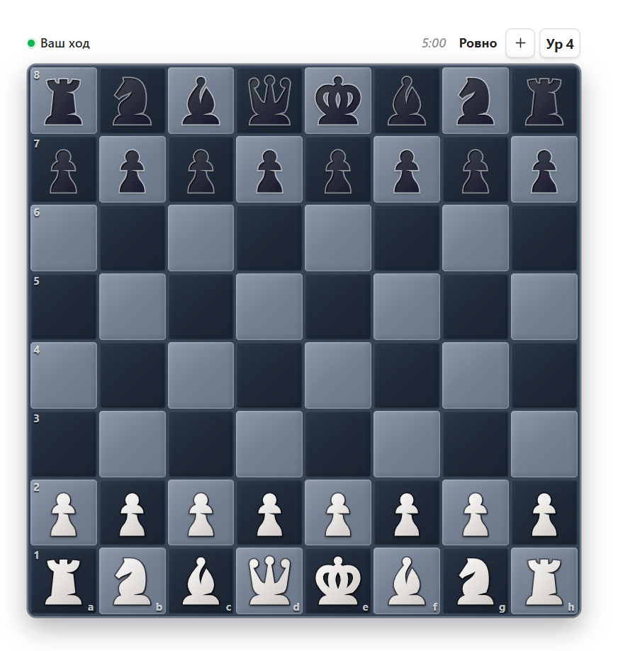

# Chess

Игра в шахматы с ботом прямо в панели [Obsidian](https://obsidian.md). Без аккаунта, без сервера, без интернета: движок работает внутри плагина, а недоигранная партия дожидается вас на том же месте.

English: [README.md](README.md)

## Что умеет

- **Десять уровней, которые действительно отличаются.** Таблица за ними собрана по замерам, а не на глаз. Слабые уровни слабы не меньшим числом: ниже четвёртого поиск не досматривает взятия в листьях, и бот ставит фигуру на поле, с которого сам только что ушёл из-под размена — это видимая ошибка, которую можно наказать, а не «пониженный рейтинг». Верхние уровни всегда играют лучший найденный ход и успевают на три-четыре полухода в свой бюджет времени.
- **Сложность, которая идёт за результатом.** По умолчанию выключена. Включите — и уровень сдвинется на единицу, когда вы выиграете (или проиграете) несколько партий подряд; порог от одной до пяти. Ничья прерывает серию, ничего не двигая, а отмена хода в законченной партии возвращает уровень обратно.
- **Часы, если нужны.** От пяти минут до часа или вовсе без них, с добавкой Фишера 2–30 секунд. Отсчёт начинается с **вашего** первого хода и идёт только пока доска открыта: закрыть Obsidian на ночь — не значит проиграть по времени.
- **Дебютная книга.** 56 линий классической теории, с пятого уровня — бот разыгрывает начало по-разному вместо одной и той же позиции каждую партию. Уровни 1–4 остаются без книги с первого хода, в этом их смысл.
- **Ход мышью, перетаскиванием или с клавиатуры.** Клик — взять, клик — поставить; можно тащить фигуру. Стрелки и Enter водят по доске без мыши, каждое поле подписано для экранного диктора.
- **Объясняет, почему ход невозможен.** Недопустимый ход подсвечивает поле красным и говорит, что мешает: перекрытый путь, связанная фигура, король под шахом — вместо молчаливо проигнорированного клика.
- **Стрелка хода бота**, чтобы на плотной доске было видно, что он сходил. Подсветка обоих полей остаётся в любом случае.
- **Перемотка партии.** ПКМ по доске — шаг назад, ЛКМ — вперёд. Просмотр не меняет результат.
- **Счёт по уровням.** Победы, поражения и ничьи на каждом сыгранном уровне: в подсказке кнопки, в меню уровней и в настройках. Партия идёт в счёт того уровня, на котором её играли.
- **Звуки** ходов, взятий, шаха и окончания партии — синтезируются на лету, без аудиофайлов; громкость настраивается, можно выключить.
- **Компьютер и телефон.**

## Как начать

Доска открывается значком короны на ленте или командой **Открыть доску**.

- **Уровень.** Кнопка на панели доски показывает текущий. Клик — на ступень выше, колесо мыши — в обе стороны, правая кнопка — сразу вся лестница: у каждой ступени написано, как она играет, и ваш счёт против неё.
- **Новая партия / сдаться.** Кнопка одна и понимает, что вы имеете в виду: в идущей партии предложит сдаться, в законченной раздаст следующую. Enter начинает новую, когда результат уже на доске.
- **Превращение.** Пешка на последней горизонтали открывает выбор фигуры; Escape отменяет ход.

Идущая партия хранится в `data.json` плагина — переживает перезапуск и синхронизируется вместе с хранилищем, если вы синхронизируете эту папку.

## Как устроен бот

Альфа-бета с транспозиционной таблицей, итеративным углублением, досмотром взятий в листьях и оценкой по таблицам полей; правила — [chess.js](https://github.com/jhlywa/chess.js). Поиск живёт в Web Worker, поэтому доска не подвисает, пока бот думает. С chess.js он говорит через внутренний генератор ходов, а не `moves({ verbose: true })`: тот дороже примерно в 35 раз на узел и раньше держал поиск на двух полуходах на всех уровнях.

## Благодарности

Рисунки фигур не мои и лицензированы отдельно от кода плагина — см. [THIRD_PARTY_NOTICES.md](THIRD_PARTY_NOTICES.md).

## Лицензия

Код плагина — [MIT](LICENSE). Рисунки фигур под неё не подпадают и живут по своей
лицензии, см. [THIRD_PARTY_NOTICES.md](THIRD_PARTY_NOTICES.md).
